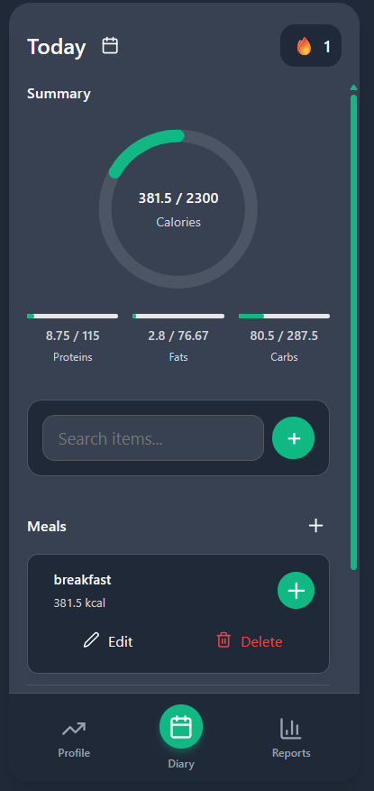
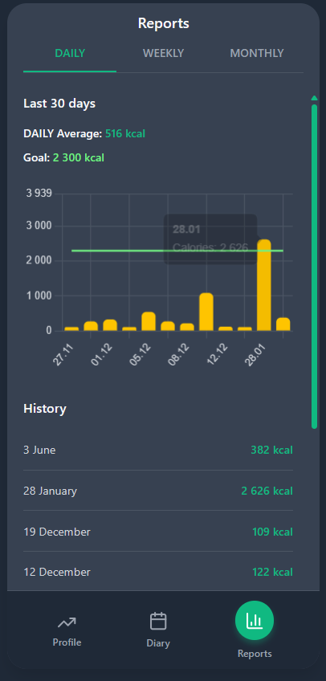
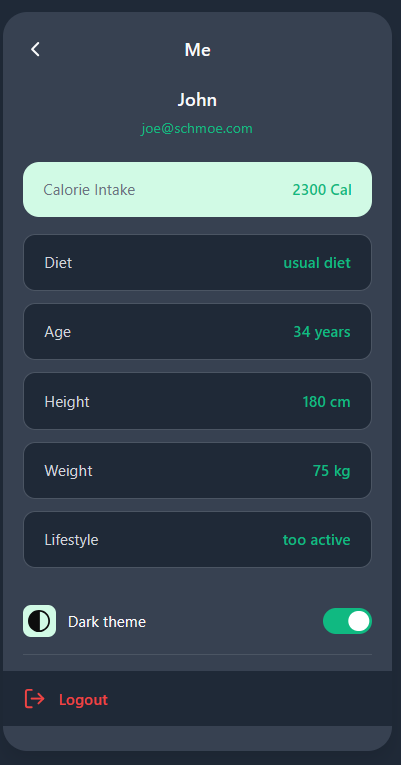

<div align="center">
  <br />
  <h1 style="font-size: 3rem; font-weight: bold;">🥑 Eatly</h1>
  <p>
    <strong>Web tool for daily calorie tracking and diet monitoring</strong>
  </p>
  <p>
    Сучасна платформа для контролю харчування, моніторингу нутрієнтів та підтримки здорового способу життя.
  </p>

  <p>
    <a href="#-про-проєкт">Про проєкт</a> •
    <a href="#-основні-можливості">Можливості</a> •
    <a href="#-стек-технологій">Стек технологій</a> •
    <a href="#-моя-роль-та-внесок">Моя роль</a> •
    <a href="#-архітектура-та-бд">Архітектура</a> •
    <a href="#-початок-роботи">Початок роботи</a>
  </p>

  <!-- Badges -->
  
  
  
  
  
  
</div>

<br />

## 📖 Про проєкт

**Eatly** — це вебінструмент, створений для спрощення щоденного обліку калорій, білків, жирів та вуглеводів. Додаток допомагає користувачам контролювати свій раціон відповідно до обраної дієти, інтегрує зовнішні бази даних продуктів та автоматично розраховує персональні норми споживання на основі індивідуальних параметрів тіла й активності.

Проєкт реалізовано  **командою розробників, а саме Matvii Torop, Andrii Maydanovych, Mycola Lytvynenko**.

## ✨ Основні можливості

### 🍎 Для користувачів
* **Щоденний щоденник харчування:** Додавання прийомів їжі (сніданок, обід, вечеря тощо) та інтерактивне керування порціями продуктів.
* **Аналітика та статистика:** Візуалізація спожитих калорій та балансу БЖВ порівняно з персональною ціллю за допомогою детальних графіків за день, тиждень, місяць.
* **Калькулятор денної норми :** Автоматичний розрахунок норми калорій за формулою Mifflin-St Jeor з урахуванням рівня фізичної активності та типу дієти.
* **Вогник активності:** Ігрова механіка утримання щоденного прогресу відвідувань для стимуляції регулярного ведення щоденника.
* **Темна та світла теми:** Адаптивний інтерфейс для комфортного використання у будь-який час доби.

### ⚙️ Системні та технічні функції
* **Гнучка GraphQL API схема:** Використання єдиної точки доступу для швидкого обміну даними між клієнтом та сервером.
* **Зовнішня інтеграція:** Пошук та імпорт сертифікованих харчових продуктів через інтегрований сервіс FatSecret API.
 **Адаптивність під потреби:** Користувач може створювати власну їжу відповідно до своїх потреб, і зразу використовувати для розрахунків.
* **Безпека:** JWT-авторизація з використанням Secure Cookies для захисту користувацьких сесій.

## 🛠 Стек технологій

| Рівень | Технології |
| :--- | :--- |
| **Frontend** | React, TypeScript, HTML5, CSS3, React Router v6 |
| **State Management** | Redux Toolkit, RxJS, Redux Observable (Epics) |
| **Backend** | C#, ASP.NET Core Web API (NET 8) |
| **Database & ORM** | MS SQL Server, Dapper |
| **API Layer** | GraphQL (GraphQL-dotnet), GraphQL Playground |
| **Інтеграції** | FatSecret API (OAuth 2.0 Client Credentials) |

## 💻 Ролі та внески 
## Mycola Lytvynenko — Full Stack Developer, Core Logic & Front-end

Як **Full Stack Developer** моїми ключовими завданнями та досягненнями були:

* **Проєктування DAL та GraphQL API:** Розробив архітектуру доступу до даних та створив GraphQL-ендпоінти для ключового функціонала зокрема, транзакцій логування їжі, динамічного розрахунку денних лімітів та редагування профілю користувача.
* **Модуль статистики та дашборд:** Створив клієнтські модулі "User Dashboard" та "Reports" з використанням Chart.js для наочної візуалізації нутрієнтів у розрізах різних часових періодів.
* **Асинхронний стейт-менеджмент:** Застосував зв'язку RxJS та Redux Observable для обробки складних побічних ефектів, наприклад, для реалізації логіки реального часу для відстеження вогника активності користувача.
* **Стабілізація та оптимізація:** Оптимізував цикли рендерингу React-компонентів, налаштував валідацію форм через React Hook Form, а також виправив помилки у математичній логіці перерахунку калорійності страв при зміні ваги порцій.

---

##  Matvii Torop — Lead Architect / Full Stack Developer, Core Logic & Front-end
Моїми ключовими завданнями та досягненнями були:

* **Проєктування системної архітектури:** Розробив базовий каркас вебдодатку, налаштував наскрізну JWT-аутентифікацію на основі Secure Cookie та інтегрував роботу із зовнішнім API FatSecret OAuth 2.0.
* **GraphQL API для профілю та нотаток:** Спроектував схеми та реалізував GraphQL-ендпоінти для керування профілем користувача, реєстрація/вхід в акаунт, зміна пароля/email та базової CRUD-логіки категорій Meal Types.
* **Авторизація та безпека клієнта:** Створив захищені маршрути  на фронтенді, реалізував механізм штучної затримки запитів при вході/реєстрації для підвищення стійкості до brute-force атак.
* **Інтерактивний UX пошуку та вибору їжі:** Розробив компоненти пошуку продуктів, модальні вікна характеристик страв з можливістю динамічного вибору прийому їжі, а також реалізував логіку швидкого додавання та видалення страв з денного раціону.


##  Andrii Maydanovych — Full Stack Developer, Database & Core Log Logic
Моїми ключовими завданнями та досягненнями були:

* **Розробка бізнес-логіки логування харчування:** Спроектував та реалізував структуру таблиць та GraphQL-ендпоінти для сутностей `Days`, а саме додавання, вибірка за днями та користувачами, оновлення ваги порцій.
* **Система кастомних продуктів (Items & Calories):** Розробив функціонал додавання та редагування власних продуктів харчування (`addCustomItem` / `ChangeCustomItem`) з розрахунком КБЖВ та калорійності (`ItemCalories`) у перерахунку на 100 грамів.
* **Інтегрований модуль нотаток:** Реалізував повноцінний вбудований нотатник на бекенді та фронтенді з підтримкою створення, сортування, маркування виконаних завдань та видалення записів.
* **Оптимізація вибірки даних для звітів:** Спроектував оптимізовані GraphQL-запити `GetDays` для отримання розширеної статистики за попередні періоди, що дозволило побудувати точні графіки динаміки калорійності.

## 📸 Скріншоти

<div align="center"> 
  
  <p><em>Інтерфейс щоденника харчування та трекер калорій</em></p>
</div>

<br/>

<div align="center" style="display: flex; gap: 10px; justify-content: center;">
  
  
</div>

## 🗄️ Архітектура та БД

Проєкт побудовано на базі реляційної бази даних MS SQL Server із застосуванням мікро-ORM Dapper для високопродуктивного виконання запитів.

* **Repository Pattern:** Кожній сутності відповідає свій репозиторій (`IUserRepository`, `IDaysRepository`, `IItemsRepository`, `INotesRepository` тощо).
* **Services:** Логіка розділена на сервіси, кожний з яких відповідає лише за свою частину функціоналу (`CalorieStandardService`, `StreakService`, `DaysService`, `FatSecretService`).
* **Authentication:** JWT-токени генеруються на бекенді та зберігаються у захищених `HttpOnly` куках для запобігання XSS-атакам.

## 🚀 Початок роботи

### Передумови
* [.NET 8.0 SDK](https://dotnet.microsoft.com/download)
* [Node.js](https://nodejs.org/) (рекомендовано LTS)
* MS SQL Server LocalDB або Express інстанс

### Інсталяція та запуск

1. **Клонування репозиторію**
   ```bash
   git clone https://github.com/your-team/eatly.git
   cd eatly
   ```

2. **Налаштування конфігурації бекенду**
   Перевірте параметри підключення до бази даних у файлі `appsettings.json`:
   ```json
   "ConnectionStrings": {
     "DefaultConnection": "Data Source=(localdb)\\MSSQLLocalDB;Initial Catalog=Eatly;Integrated Security=True;Encrypt=True"
   }
   ```

3. **Запуск сервера та клієнта у режимі розробки**
   Завдяки інтегрованому процесу в `Program.cs`, під час запуску ASP.NET Core додатку в режимі `Development` автоматично ініціюється Vite-сервер для фронтенду:
   ```bash
   cd project_server
   dotnet run
   ```

4. **Відкрийте додаток у браузері**
   * Клієнтська частина: `http://localhost:5173` (або порт, вказаний Vite)
   * GraphQL Playground: `https://localhost:7049/graphql/playground`

---

<div align="center">
  <p>Розроблено командою with ❤️</p>
</div>